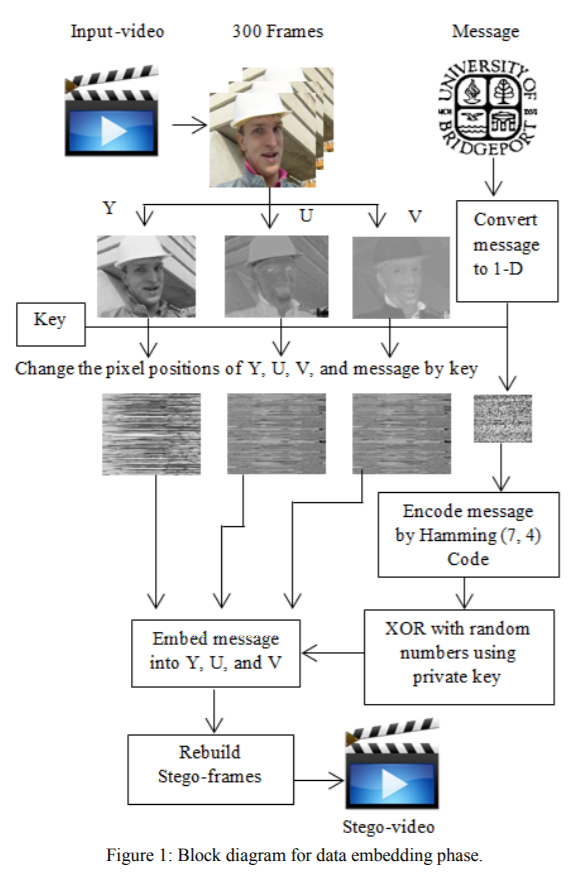
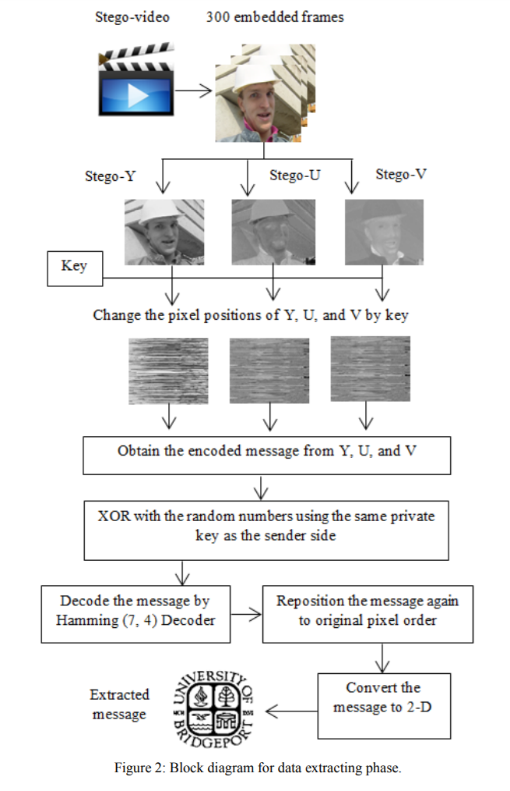

## Design Details

The folowing points will be implemented in MATLAB

### Sender's Side:

* Convert the video stream into frames.

* Separate each frame into Y, U and V components. 

* Change the position of all pixels in three components Y, U and V by a special key.

* Convert the message which is to be sent to a one dimension array, and then change the position of the whole message by a key.

* Encode each 4 bits of the message using Hamming (7, 4) encoder.

* The result of the encoded data, which consists of 7 bits (4 bits of message + 3 bits of parity) is XORed with the 
7 bits of random value using a key.

* The pixels are then repositioned to the original locations and the video is rebuilt.

### Receivers's Side:

* Convert the video stream into frames.

* Separate each frame into Y, U and V components.

* Change the position of all pixel values in the three Y, U, and V components by the special key that was used in the embedding process.

* Obtain the encoded data from the YUV components and XOR with the random number using the same key that was used in the sender side.

* Decode 4 bits of the message by the Hamming decoder.

* Reposition the whole message again into the original order.

* Convert the message array to two dimensions.

