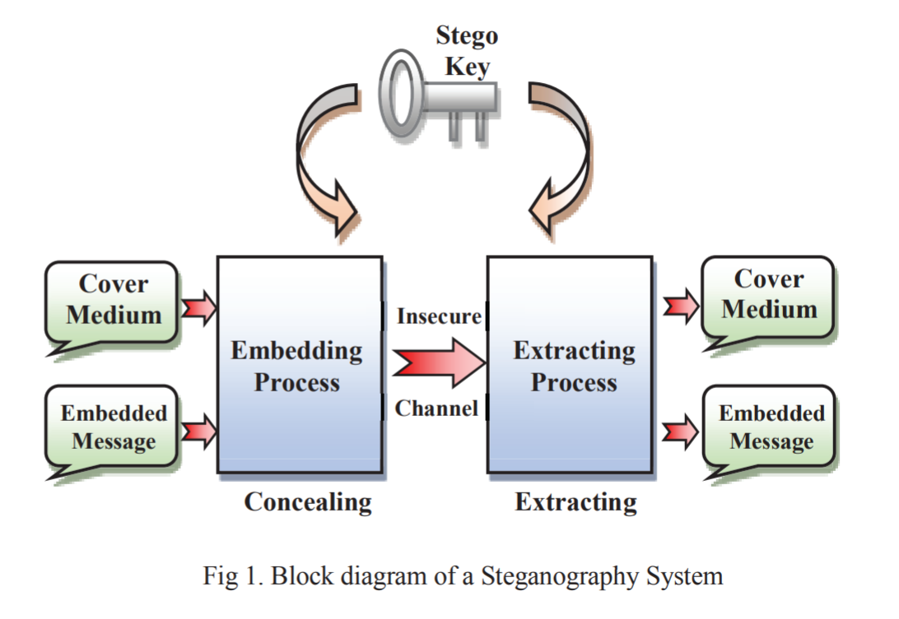
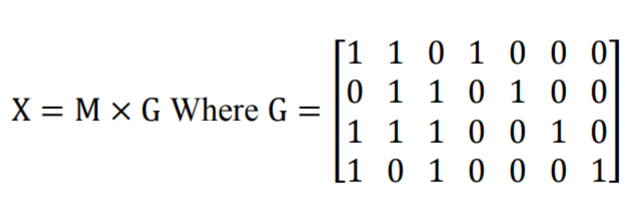
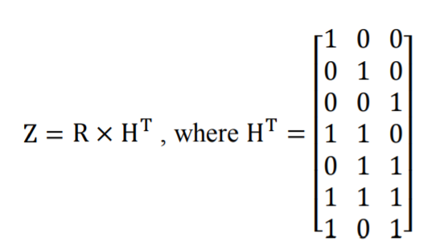

# Introduction
Due to connected nature of world because of the Internet many computer systems and other devices have become prone to attacks. Preventing unauthorized access, use, disclosure or destruction of data is gaining importance in the Digital world. Steganography and data hiding have become necessary for information security.  

## Steganography
Steganography is the art and science of writing covert messages such that the presence of the message is only known to the sender and the receipient. It involves concealing a file, message, image, or video within another file, message, image, or video. If cover is video file then it is called Video Steganography.

There are two important factors that every successful steganography system should take into consideration, which are embedding efficiency and embedding payload. 

* First, the steganography scheme that has a high embedding efficiency means good quality of stego data and less amount of host (carrier) data are going to be changed. 

* Second, the high embedding payload means the capacity of secret
information to be hidden inside host data is large.  

### Some implementations fo video steganography
* In 2012, Rongyue et al proposed an efficient BCH coding
for steganography which is embedding the secret information
inside a block of cover data by changing some coefficients.
Authors have improved the computational time of the system
and the complexity becomes low because of the system’s
linearity.

* In 2013, Liu et al proposed a robust data hiding scheme in
H.264 compressed video stream, where they have prevented a
drift of intra-frame distortion. To give the system more
robustness, authors have encoded the message using BCH
code before making the embedding process. The host data is
the DCT coefficients of the luminance I-frame component.
The obtained results have a high quality and robustness. 

## (7, 4) Hamming Code

The Hamming code is one of the most well-known block code methods that can do both error detection and correction on a block of data. In the Hamming code technique, the original information will be coded by adding some extra data
with the minimum amount of redundancy, which is called the codeword, of length n bits. The added part consists of parity information of length (n-k) bits where k is the length of message that is expected to be coded.

The Hamming codes are linear codes so they have two matrices: parity-check matrix H and generator matrix G, which they need for both encoding and decoding. 

On the encoding side, each message M, which consists of 4-bits, will be multiplied by the generator matrix and then have modulo of 2 applied; the result is the codeword X of 7-bits ready to be sent through a noisy channel.

On the decoding side, for the purpose of checking the encoded message of 7-bits R (data + parity) will be received,
then will be multiplied by the transpose of the parity-check matrix, and taking modulo of 2 again. 

The result is a syndrome vector Z (z1, z2, z3) of three bits, which has to be all zeroes (000) if it’s an error-free message. Otherwise, any change in the message during transmission will lead to flipping one or more bits of the message; then it needs an error correction process. 

