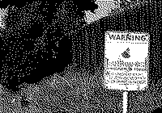
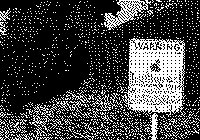

# Data Communications (CO250): Mini-Project

**Title:**

A Highly Secure Video Steganography using Hamming Code (7, 4)

**Members:**

Dibyadarshan Hota (16C0154) - <dibyadarshan.hota@gmail.com>

Omkar Prabhu (16C0233) - <omkarp.nitk@gmail.com>

**Abstract:**

Preventing unauthorized access, use, disclosure or destruction of data is gaining importance in the Digital world. Steganography and data hiding have become necessary for information security. Steganography is the practice of concealing a file, message, image, or video within another file, message, image, or video. 

The paper referenced has proposed a secure video steganography algorithm using linear block code. The algorithm requires a video to be converted into frames and changing the pixel positions. The message which is to be transmitted must be converted into one-dimension, XOR and Hamming code are applied to this message. Then this encoded message is embedded in the scrambled video frames. These frames are reconstructed and sent to the receiver. The receiver can extract information using the same key as the sender side. The receiver has to disassemble the video, use XOR and hamming code to reconstruct the correct intended message.

**Objectives:**
* Implement the following in MATLAB:
    
    At sender's side:

    * Conversion of video frames into a YUV format.

    * Applying (7, 4) Hamming code to 1D structure of message which is a image to obtain the codeword.

    * Embedding the message codeword into the video frames.

    * Recontruct the video from the frames.

    At receiver's side:

    * Split the received video into frames and convert them to YUV format.

    * Retrieve back the message codeword from the frames.

    * Retrieve back original message from the message codeword by using decoding for hamming code.  
       

**References:**

Ramadhan J. Mstafa, Khaled M. Elleithy, "A highly secure video steganography using Hamming code (7, 4)," presented at Systems, Applications and Technology Conference (LISAT), 2014 IEEE Long Island, Farmingdale, NY, USA, May 2-2, 2014. 

[View Paper](http://ieeexplore.ieee.org/document/6845191/)

## Usage

* Specify the video to be used in the files: `main.m`, `frames_to_video.m` and `receiver_retrieve.m` 

* Specify the key to be used in the file `main.m`

* Run the following files in order 

    1. `main.m` : In the `frames` directory the following would be present
        * `framesRGB` : RGB frames of the video `small.mp4` or `large.mp4`
        * `framesY` : srambled Y components for RGB frames
        * `framesU` : srambled U components for RGB frames
        * `framesV` : srambled V components for RGB frames

    2. `embed_message.m` : The binary image `message.png` will be embedded into the scrambled Y, U, V components. 

    3. `combine_frames.m` : In the directory `frames\embeddedFramesRGB`, the embedded RGB frames will be created.

    4. `frames_to_video.m` : Video named `em_small.avi` will be created from the embedded RGB frames.

    5. `receiver_retrieve.m` : From the video `em_small.avi` the message will be constructed back and displayed.

    6. `psnr.m` : Displays the PSNR value comparing the original and retrieved image message.

## Results

Original message:

  

* Using `large.mp4` the retrieved message and PSNR is: infintiy 

  

* Using `small.mp4` the retrieved message and PSNR is: 13.9140

 

## File Structure

* `Introduction.md` - Explains theoretical aspects of the mini project.

* `Design.md` - Explains design aspects of the mini project.

* `main.m` - Main module of the implementation.

* `construct_frames.m` - Construct RGB frames from the video and get their Y, U, V components. Save them in the mentioned      location.

* `embed_message.m` - Applying (7, 4) Hamming Code to the message and embed the same into the scrambled Y, U, V frames.

* `combine_frames.m` - Combine the embedded Y, U, V frames into their embedded RGB frame.

* `frames_to_video.m` - Construct the video from the embedded RGB frames.

* `receiver_retrieve.m` - From the constructed video after embedding, it will retrieve the message back after applying Hamming correction.

* `psnr.m` - Calculate Peak signal-to-noise ratio.

* `scramble.m` - Scrambles all the Y, U, V frames given their directory based on a key.

* `unscramble.m` - Unscrambles all the Y, U, V frames given their directory based on a key.

* `yuv2rgb.m` - Converts Y, U, V components into a single RGB frame.

* `rgb2yuv.m` - Converts a RGB frame to its Y, U, V components.

* `small.mp4` - Video used to embed message into.

* `large.mp4` - Video used to embed message into.

* `message.png` - Binary image to be sent after embedding it into small.mp4 video and retreived at the other end.

